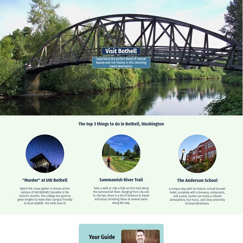
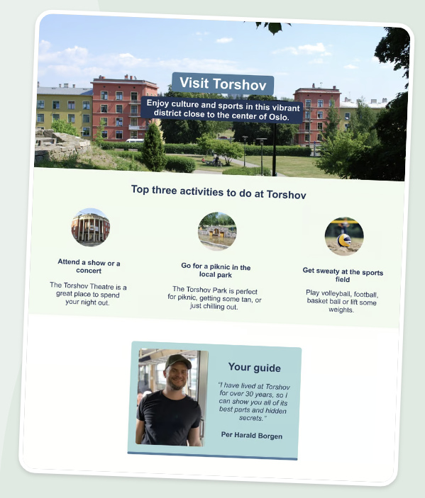

# hometown-homepage

## Project Overview 
"Hometown Homepage" is a website for selling a traveler on a visit to my hometown Bothell, Washington. Basic HTML, and CSS are both demonstrated. Stretch goals were completed and functionality was expanded beyond the original scope. Added functionality includes highlighting page elements on hover, 3 additional pages with details for each attraction, all information was replaced with information relating to my hometown and a new Google Font (Fire Sans) was utilized. Several color palettes were considered but none looked better than the original palette. The original site sample was duplicated to fulfill the original requirements before stretch goals were targeted.

## Features

__Requirements:__  
- Build it from "scratch" (Figma file provided)
- Make sure you use:
    - Classes
    - Flexbox
    - Background-image
    - The color palette

__Stretch Goals:__  

- Make it about your own hometown, country, or whatever place you like
- Use a different color palette
- Add a Google Font
- Find a way to use :hover
- Add a whole new section

 

**My Implementation:** 

- I started by replacing all of the text and image content on the original site with information about myself and my hometown
- Hover funcationality was added to highlight each attraction as clickable
- New pages were added to contain detailed information about each attraction
- Return navigation was added to content pages that also utilized hover functionality
- The "Fire Sans" Google Font was added to the page
- Several color palettes at Coolors.co were considered but none matched the blues and greens of my source images as well

## Challenges and Learning

### Code Review Notes

- Encouraged to avoid using IDs when possible, this allows for application of CSS properties to additional objects just by including an additional class rather than revising an ID to fit more elements. I have noted this advice during my Scrimba studies but did not keep the thought as part of my focus when creating this project.
- One clarifying comment from the mentor was that ids are primarily used for connecting JavaScript to specific elements
- Media Queries were suggested to make the page adjust to various sizes more cleanly. I had some experience from a long time ago with media queries but they had not been covered in the course material up to the point when I created the project so I wasn't as concerned with reviewing and practicing them while making the project
- Encouraged to approach the page with a mobile-first design. This makes sense to me in general, my original focus was to match the provided sample page as closely as possible but I'll keep this in mind for any revisions to the project.
- While watching a Scrim created by the code reviewer, I noted that some elements which appear centered for me appeared left-aligned in the video. My Scrim did not reflect this and neither did the live site so I wondered if this might be a browser-unique issue or something else.

## Installation
Install the dependencies and run the project

npm install 
npm start 
Head over to https://vitejs.dev/ to learn more about configuring vite

## Contributing
Feel free to fork this project and submit pull requests. You can also open issues for any bugs you find or enhancements you think would be useful.

## Authors
John Okleberry - [Github profile](https://github.com/John-Okleberry)

About Scrimba
At Scrimba our goal is to create the best possible coding school at the cost of a gym membership! 💜 If we succeed with this, it will give anyone who wants to become a software developer a realistic shot at succeeding, regardless of where they live and the size of their wallets 🎉 The Frontend Developer Career Path aims to teach you everything you need to become a Junior Developer, or you could take a deep-dive with one of our advanced courses 🚀

Our courses
The Frontend Career Path
Become a Scrimba Pro member
Happy Coding!
